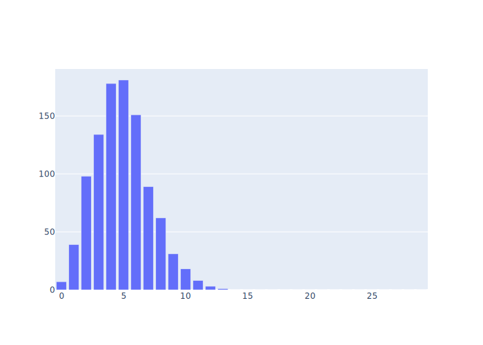
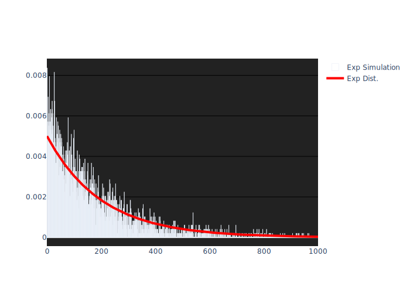
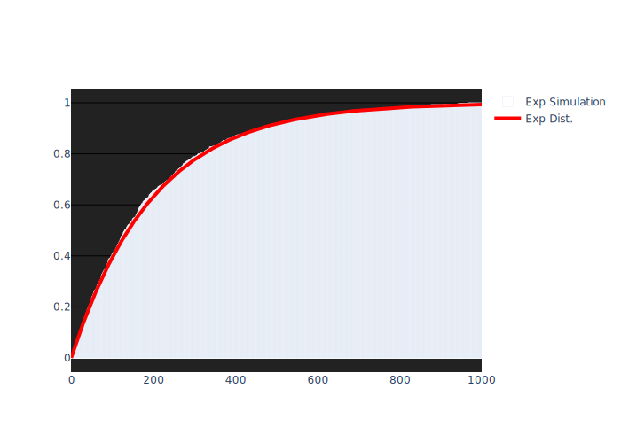
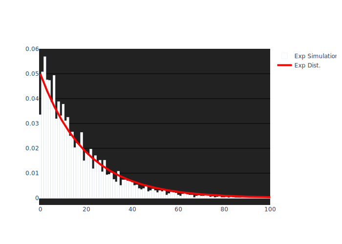
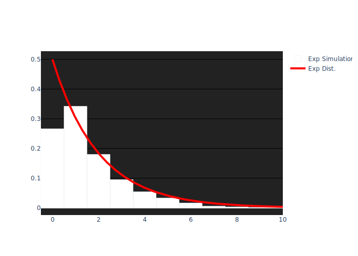
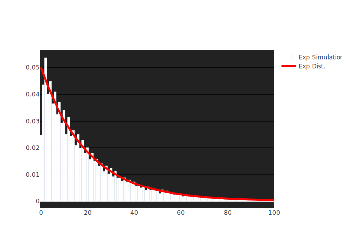

# 확률과 통계 HW 3

##### Relations between Poisson & Exponential Dist.

 

2021031685 유성민

---
## Contents

- **Poisson Modeling**
  - Design
  - Implement
  - Simulation Result
- **Exponential Modeling**
  - Design - PDF
  - Design - CDF
  - Implement
  - Simulation Result
- **Analysis**
- **Conclusion**

---

## Poisson Modeling

##### Designing Poisson Distribution

$X$를 성공확률 $p$인 Bernoulli 시행에서의 성공 횟수라고 하면, $X \sim \mathrm{B}(n,p)$이다.

여기서 $n = 1000$, $p = 0.005$로 설정하면 $X$의 기댓값 $\lambda$는 다음과 같다.

$$
  \lambda = np = 5
$$

포아송 분포는 이항 분포에서 $n \to \infty$일 때 얻을 수 있으므로, $X$는 평균이 $\lambda$인 포아송 분포를 따를 것이라고 기대할 수 있다.

---

## Poisson Modeling

##### Implementation through Python

- $p = 0.005$인 베르누이 시행을 위하여 $[1, 200]$ 구간의 random한 정수를 `randint()`함수를 이용하여 uniformly 생성하고, 그 정수가 10일 때만 `True`를 반환하게 한다.
- $k$번 성공할 횟수를 저장하는 길이 $n = 1000$의 list인 `PoissonRVList`를 만든다.

###### Trial: Poisson

1. $n = 1000$번의 베르누이 시행을 통해, 성공(`return True`)한 횟수($k$)를 센다.
2. `PoissonRVList[k]`에 1을 더한다.
3. 이를 $m = 1000$번 반복하여 충분히 list에 정보를 기록한다.

---

## Poisson Modeling

##### Simulation Result

`PoissonRVList`에서 성공 횟수가 30 이하인 경우만 히스토그램으로 나타내면 다음과 같다.

<figure style="display:flex; flex-direction: column; align-items: center;">

<figcaption>Fig 1. Histogram of Simulation</figcaption>
</figure>
<figure style="display:flex; flex-direction: column; align-items: center;">

<figcaption>Fig 2. Normalized Histogram & Plot</figcaption>
</figure>

---

## Poisson Modeling

##### Simulation Result (Cont.)

Figure 1의 히스토그램은 $X$의 성공 횟수 $k$에 대한 도수분포를 나타낸 것이다. $X$의 평균인 $\lambda = 5$의 도수가 가장 높음을 알 수 있다.

이를 시행의 반복 횟수인 $m = 1000$으로 나누면, Normalize 된 히스토그램을 얻을 수 있다. (Figure 2.)

포아송 분포의 PMF는 $p_X (x) = \dfrac{\lambda^x e^{-\lambda}}{x!}$ 이고, 이를 Normalize 된 히스토그램과 겹쳐서 Plot 한 결과는 Figure 2에서 확인할 수 있다.

Figure 2에서 볼 수 있듯이, 시뮬레이션으로 도출된 히스토그램과 포아송 분포의 PMF는 상당히 유사함을 알 수 있고, 이로써 $n \to \infty$일 때 포아송 분포는 이항 분포로부터 유도될 수 있음을 실험적으로 확인할 수 있다.

---

## Exponential Modeling

##### Designing Exponential Distribution - PDF

확률 변수 $X$가 평균이 $\lambda$의 포아송 분포를 따른다면, 인접한 두 사건 간의 시간 $T$는 평균이 $1 / \lambda$인 지수 분포를 따르고, 그것의 PDF는 다음과 같다.
$$
  f_T (t)  = \lambda e ^{-\lambda t} \quad (t \ge 0)
$$

따라서, 포아송 분포를 구하는 과정에서 인접한 두 사건의 시간 간격을 기록하면, 이는 지수 분포를 따를 것이라 기대할 수 있다.

본 시뮬레이션에서 인접한 두 시행의 시간 간격을 $u$(단위 시간)라고 하면, 전체 시뮬레이션에 소요되는 시간은 $nu$라고 할 수 있고, 이 때의 평균이 $1/\lambda$이므로, **단위 시간 당 평균 소요 시간**은 $nu / \lambda$ 임을 알 수 있다.

---

## Exponential Modeling

##### Designing Exponential Distribution - CDF

평균이 $1/\lambda$인 지수 분포를 따르는 확률 변수의 CDF는 다음과 같다.
$$
  F_T (t) = 1 - e^{-\lambda t} \quad (t \ge 0)
$$

이는, $t$ 안에 처음으로 사건이 발생할 확률을 의미한다.

따라서, 포아송 분포를 구하는 과정에서 처음 사건이 발생한 시각을 기록한다면, 지수 분포의 CDF 또한 모델링 할 수 있다.

이 또한, **단위 시간 당 평균 소요 시간**은 $nu / \lambda$임을 알 수 있다.

---

## Exponential Modeling

##### Implementation through Python

- 단위 시간 $u = 1$이라고 가정한다.
- 인접한 두 사건 간의 시간 간격을 저장하는 길이 $n = 1000$인 list `ExpRVList`를 생성한다.
- 처음 사건이 발생할 때까지 걸린 시간의 도수를 기록하는 길이 $n$의 list `ExpCDFList`를 생성한다.

###### Trial: Exp

1. $n$번의 베르누이 시행 중 성공한 두 사건간의 시간 간격인 $I$를 구하고, `ExpRVList[I]`에 1을 더한다.
2. $n$번의 베르누이 시행 중 처음 성공할 때까지 걸린 시간 $t_f$을 기록한다.
3. $n$번의 베르누이 시행을 마친 후, $t \ge t_f$인 $t$에 대하여 `ExpCDFList[t]`에 1을 더한다.
4. 이 과정을 $m = 1000$번 반복한다.

---

## Exponential Modeling

##### Simulation Result 

`ExpRVList`와 `ExpCDFList`를 Normalize하고, $T$의 PDF와 CDF를 plot하면 다음과 같다.

<figure style="display:flex; flex-direction: column; align-items: center; margin:0">

<figcaption>Fig 3. Simulation & PDF</figcaption>
</figure>
<figure style="display:flex; flex-direction: column; align-items: center; margin:0">

<figcaption>Fig 4. Simulation & CDF</figcaption>
</figure>

---

## Exponential Modeling

##### Simulation Result (Cont.)

`ExpRVList`의 총 도수는 총 성공한 사건의 수와 같다. 이는 포아송 분포를 구할 때 사용된 성공 횟수인 $k$와 동일하므로, `ExpRVList`를 $\sum k$로 나누면 Normalize할 수 있다. (*Figure 3*)

이렇게 구한 대기시간 $T$는 평균이 $nu / \lambda$인 지수 분포를 따르고, 여기서 $n = 1000$, $u = 1$, $\lambda = 5$를 대입하면, 평균이 $200$인 지수 분포를 따른다고 할 수 있다. 이것의 PDF는 다음과 같고, *Figure 3*에서 그것과 히스토그램을 Plot한 결과를 확인할 수 있다.
$$
  f_T(t) = \frac{1}{200} e^{-t/200}
$$

---

## Exponential Modeling

##### Simulation Result (Cont.)

`ExpCDFList`를 구하기 위한 시행 횟수는 $m$번이다. 따라서, 이를 $m$으로 나눈다면 Normalize할 수 있다.

이는, 평균이 200인 지수 분포의 CDF를 시뮬레이션한 것이므로, *Figure 4*에서 시뮬레이션으로 구한 히스토그램과, CDF의 Plot을 확인할 수 있다.

---

## Analysis

##### Relation between Poisson & Exp. Dist.

본 시뮬레이션을 통해, 어떠한 확률 변수 $X$가 평균 $\lambda$의 포아송 분포를 따른다면, 두 인접한 사건 간의 시간 $T$는 평균 $1/\lambda$의 지수 분포를 따른다는 것을 확인할 수 있었다.

**(단위 시간의 설정과 기댓값)**

만일, $n = 1000$번의 시행 동안 걸린 시간을 단위 시간(1)이라 한다면, 그대로 $T$의 평균은 $1/\lambda$ 라고 할 수 있겠으나, 이렇게 시뮬레이션을 한다면 히스토그램에서 유의미한 $x$의 범위가 $[0,1]$로 제한되기 때문에, 시뮬레이션 확인을 위해 두 인접한 시행 간의 시간을 단위 시간으로 설정하였다.

일반적으로, 두 인접한 시행 간의 시간을 $u$라고 한다면, 전체 소요 시간은 $nu$가 되기 때문에, 히스토그램에서 유의미하게 확인할 수 있는 범위는 $[0, nu]$, 평균은 $nu / \lambda$가 됨을 알 수가 있다.

---

## Analysis

##### Change of Unit Time: $u$

따라서, 이러한 $u$를 0.1, 0.01로 변화시킨 후의 PDF 시뮬레이션은 다음과 같다.

<figure style="display:flex; flex-direction: column; align-items: center; margin:0">

<figcaption>Fig 5. PDF when u = 0.1</figcaption>
</figure>
<figure style="display:flex; flex-direction: column; align-items: center; margin:0">

<figcaption>Fig 6. PDF when u = 0.01</figcaption>
</figure>

---

## Analysis

##### Change of Unit Time: $u$ (Cont.)

일반적으로, 단위 시간이 $u$일 때 $T$의 PDF는 다음과 같다.
$$
  f_T(t) = \frac{\lambda}{nu} e^{-\lambda t / nu}
$$

$[0,nu]$ 구간에서의 모델링을 위해 `ExpRVList[I*u]`에 1씩 더해주었다.

*Figure 5*는 단위 시간 $u = 0.1$라고 한 경우이다. 구간 $[0,100]$ 의 길이 즉, 계급의 수가 충분하여 히스토그램의 모양이 잘 형성되었다. 이때의 PDF인 $f_T(t) = e^{-t/20}/20$ 의 Plot과도 잘 맞는 것을 볼 수 있다.

*Figure 6*는 단위 시간 $u = 0.01$라고 한 경우이다. 구간 $[0,10]$은 길이가 충분하지 않아서 상대적으로 부족한 히스토그램을 얻을 수 있었다. 그러나, PDF인 $f_T(t) = e^{-t/2}/2$ 의 추세를 매우 잘 따르는 것을 볼 수 있다. precision에 대한 정확한 비교를 위해서는 $n$ 값을 늘려야 할 필요가 있어 보인다.

---

## Analysis

##### Guide to Simulate Continuous R.V.

포아송 분포와는 다르게 지수 분포는 연속 확률 분포라서 PMF 즉, 확률 **밀도** 함수를 고려해야 한다. 이 밀도는 [확률 / 측도]의 차원을 가지므로, 히스토그램을 이용한 시뮬레이션이 다소 부정확할 수 있다. 
PMF는 다음과 같이 정의되므로,
$$
  f_X (x) = \lim_{\Delta \to 0} \frac{\mathrm{P}(x \le X \le x + \Delta)}{\Delta}
$$
$\Delta$가 작을수록 precise한 결과를 얻을 수 있을 것이다. 본 시뮬레이션에서 $\Delta$는 $n$이 클 수록, $u$가 작을 수록 작아진다. Trial의 반복횟수인 $m$은 PMF에서는 이 $n,~u$보다는 상대적으로 미치는 영향이 작을 것이다.

반면, CDF는 그 자체로 확률 값이므로, 포아송 분포와 비슷하게 Trial의 반복횟수인 $m$이 시뮬레이션의 정확도에 큰 영향을 미칠 것이다. 따라서, 히스토그램을 사용한 연속 R.V.의 시뮬레이션을 위해서는 CDF를 사용하는 것이 더 간단해 보인다.

---

## Analysis

##### Guide to Simulate Continuous R.V. (Cont.)

Figure 7은 $n = 10,000,~ u = 0.1$일때로, Figure 3과 Figure 5보다 더 정확하다는 것을 알 수 있다.

<figure style="display:flex; flex-direction: column; align-items: center; margin:0">

<figcaption>Fig 7. PDF when u = 0.1</figcaption>
</figure>

---

## Conclusion

본 시뮬레이션에서는 베르누이 시행을 통하여, 포아송 분포와 지수 분포를 시뮬레이션 하였다. 

특히, 지수 분포의 PDF와 CDF 모두 시뮬레이션 함으로써, 히스토그램을 사용한 시뮬레이션에서 상대적으로 유용한 방법에 대해 알아보았다.

히스토그램을 이용한 시뮬레이션의 precision을 결정하는 지배적인 변수를 확인할 수 있었다.