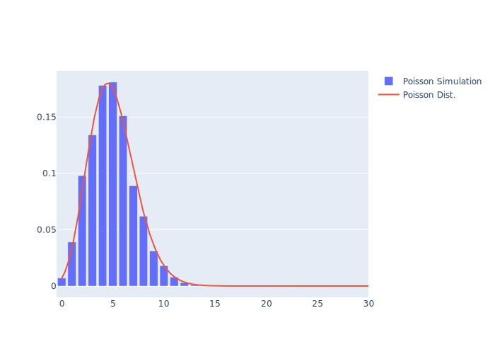

# 확률과 통계 HW 3

##### Relations between Poisson & Exponential Dist.

 

2021031685 유성민

---

## Poisson Modeling

##### Designing Poisson Distribution

$X$를 성공확률 $p$인 Bernoulli 시행에서의 성공 횟수라고 하면, $X \sim \mathrm{B}(n,p)$이다.

여기서 $n = 1000$, $p = 0.005$로 설정하면 $X$의 기댓값 $\lambda$는 다음과 같다.

$$
  \lambda = np = 5
$$

포아송 분포는 이항 분포에서 $n \to \infty$일 때 얻을 수 있으므로, $X$는 평균이 $\lambda$인 포아송 분포를 따를 것이라고 기대할 수 있다.

---

## Poisson Modeling

##### Implementation through Python

- $p = 0.005$인 베르누이 시행을 위하여 $[1, 200]$ 구간의 random한 정수를 `randint()`함수를 이용하여 uniformly 생성하고, 그 정수가 10일 때만 `True`를 반환하게 한다.
- $k$번 성공할 횟수를 저장하는 길이 $n = 1000$의 list인 `PoissonRVList`를 만든다.

###### Trial

1. $n = 1000$번의 베르누이 시행을 통해, 성공(`return True`)한 횟수($k$)를 센다.
2. `PoissonRVList[k]`에 1을 더한다.
3. 이를 $m = 1000$번 반복하여 충분히 list에 정보를 기록한다.

---

## Poisson Modeling

##### Simulation Result

`PoissonRVList`에서 성공 횟수가 30 이하인 경우만 히스토그램으로 나타내면 다음과 같다.

<figure style="display:flex; flex-direction: column; align-items: center;">

<figcaption>Fig 1. Histogram of Simulation</figcaption>
</figure>
<figure style="display:flex; flex-direction: column; align-items: center;">

<figcaption>Fig 2. Normalized Histogram & Plot</figcaption>
</figure>

---

## Poisson Modeling

##### Simulation Result (Cont.)

Figure 1의 히스토그램은 $X$의 성공 횟수 $k$에 대한 도수분포를 나타낸 것이다. $X$의 평균인 $\lambda = 5$의 도수가 가장 높음을 알 수 있다.

이를 시행의 반복 횟수인 $m = 1000$으로 나누면, Normalize 된 히스토그램을 얻을 수 있다. (Figure 2.)

포아송 분포의 PMF는 $p_X (x) = \dfrac{\lambda^x e^{-\lambda}}{x!}$ 이고, 이를 Normalize 된 히스토그램과 겹쳐서 Plot 한 결과는 Figure 2에서 확인할 수 있다.

Figure 2에서 볼 수 있듯이, 시뮬레이션으로 도출된 히스토그램과 포아송 분포의 PMF는 상당히 유사함을 알 수 있고, 이로써 $n \to \infty$일 때 포아송 분포는 이항 분포로부터 유도될 수 있음을 실험적으로 확인할 수 있다.

---

## Exponential Modeling

##### Designing Exponential Distribution - PDF

확률 변수 $X$가 평균이 $\lambda$의 포아송 분포를 따른다면, 인접한 두 사건 간의 시간 $T$는 평균이 $1 / \lambda$인 지수 분포를 따르고, 그것의 PDF는 다음과 같다.
$$
  f_T (t)  = \lambda e ^{-\lambda t} \quad (t \ge 0)
$$

따라서, 포아송 분포를 구하는 과정에서 인접한 두 사건의 시간 간격을 기록하면, 이는 지수 분포를 따를 것이라 기대할 수 있다.

본 시뮬레이션에서 인접한 두 시행의 시간 간격을 $u$(단위 시간)라고 하면, 전체 시뮬레이션에 소요되는 시간은 $nu$라고 할 수 있고, 이 때의 평균이 $1/\lambda$이므로, 단위 시간 당 평균 소요 시간은 $nu / \lambda$ 임을 알 수 있다.

---

## Exponential Modeling

##### Designing Exponential Distribution - CDF

평균이 $1/\lambda$인 지수 분포를 따르는 확률 변수의 CDF는 다음과 같다.
$$
  F_T (t) = 1 - e^{-\lambda t} \quad (t \ge 0)
$$

이는, $t$ 안에 처음으로 사건이 발생할 확률을 의미한다.

따라서, 포아송 분포를 구하는 과정에서 처음 사건이 발생한 시각을 기록한다면, 지수 분포의 CDF 또한 모델링 할 수 있다.

이 또한, 단위 시간 당 평균 소요 시간은 $nu / \lambda$임을 알 수 있다.

---

## Exponential Modeling

##### Implementation through Python

- 단위 시간 $u = 1$이라고 가정한다.
- 인접한 두 사건 간의 시간 간격을 저장하는 길이 $n = 1000$인 list `ExpRVList`를 생성한다.
- 처음 사건이 발생할 때까지 걸린 시간의 도수를 기록하는 길이 $n$의 list `ExpCDFList`를 생성한다.

**Trial**

1. $n$번의 베르누이 시행 중 성공한 두 사건간의 시간 간격인 $t_I$를 구하고, `ExpRVList[t]`에 1을 더한다.
2. $n$번의 베르누이 시행 중 처음 성공할 때까지 걸린 시간 $t_f$을 기록한다.
3. 베르누이 시행을 마친 후, $t \ge t_f$인 $t$에 대하여 `ExpCDFList[t]`에 1을 더한다.
4. 이 과정을 $m = 1000$번 반복한다.

---

## Poisson Modeling

##### Simulation Result - PDF

`ExpRVList`와 `ExpCDFList`를 Normalize하고, $T$의 PDF와 CDF를 plot하면 다음과 같다.

<figure style="display:flex; flex-direction: column; align-items: center;">

<figcaption>Fig 1. Simulation & PDF</figcaption>
</figure>
<figure style="display:flex; flex-direction: column; align-items: center;">

<figcaption>Fig 2. Simulation & CDF</figcaption>
</figure>

---