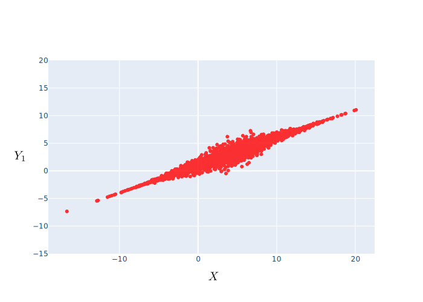
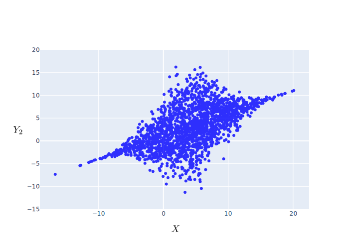
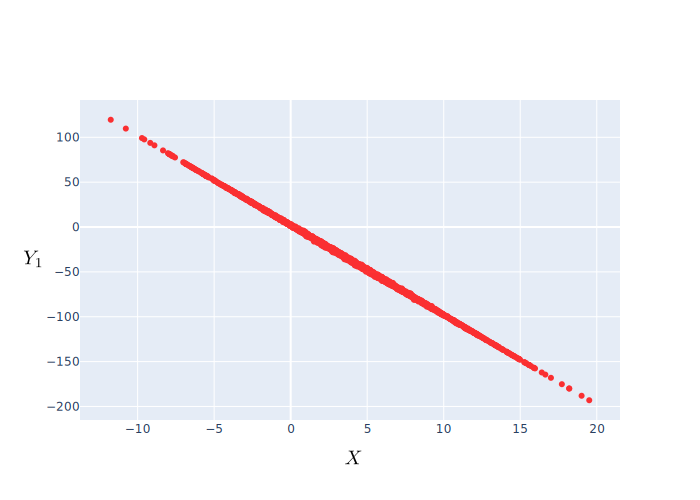
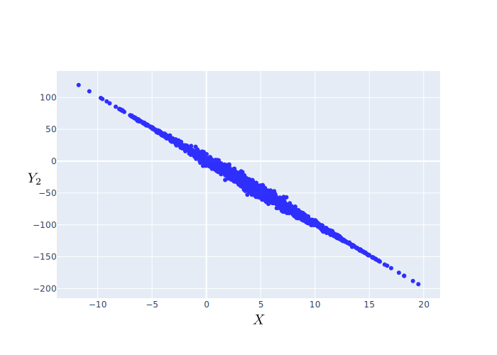
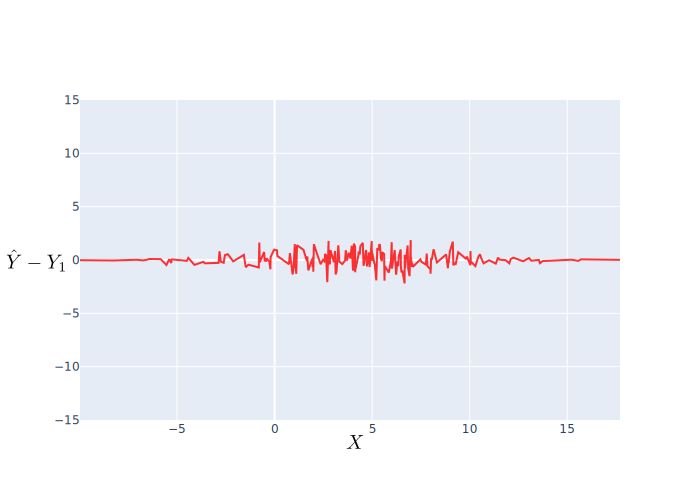
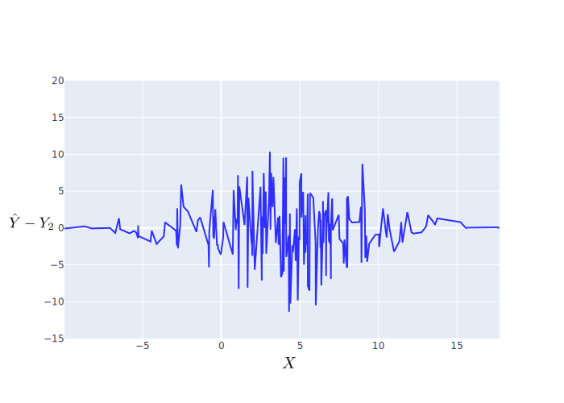

# 확률과 통계 Term Project

##### Correlation and Estimation of Two RVs

 

2021031685 유성민

---

## Contents

- **Finding Correlation**
  - RV Generation
  - Correlation Coefficients
  - Vary $a,b$
- **Estimation**
  - RV Generation
  - MSE
- **Analysis**
  - Correlation
  - Estimation
- **Conclusion**

---

## Finding Correlation

##### Generating Random Variables [Case 1]

세 확률변수 $X, Y_1, Y_2$ 를 다음과 같이 생성한다.

$$
  X \sim \mathcal{N}(4, 5^2)
$$
$$
  \begin{align*}
    Y_1 &= aX + b + \mathcal{N}_Z(0, 1^2)~ \mathrm{e}^{-(X - 4)^2 / 50} \\
    Y_2 &= aX + b + \mathcal{N}_Z(0, 5^2)~ \mathrm{e}^{-(X - 4)^2 / 50} \\
  \end{align*}
$$
단, 여기서 $\mathcal{N}(\mu, \sigma^2)$ 는 평균 $m$, 표준편차 $\sigma$ 인 정규분포를 의미하고,

$\mathcal{N}_Z(\mu_Z, \sigma_Z^2)$ 는 $Z \sim \mathcal{N}(\mu_Z, \sigma_Z^2)$ 인 확률변수 $Z$를 의미한다.

---

## Finding Correlation

##### Ploting Random Variables [Case 1]

총 2000개의 sample을 뽑았으며, $a = 0.5$, $b = 1$ 로 설정하였을 떄의 Plot은 다음과 같다.

<figure style="display:flex; flex-direction: column; align-items: center; margin:0">

<figcaption>Fig 1. Plot of (X, Y1) </figcaption>
</figure>
<figure style="display:flex; flex-direction: column; align-items: center; margin:0">

<figcaption>Fig 2. Plot of (X, Y2)</figcaption>
</figure>

---

## Finding Correlation

##### Calculating Correlation Coefficient [Case 1]

Figure 1, 2에서 확인할 수 있듯이, $\sigma_Z$가 큰 $Y_2$가 $Y_1$에 비해 퍼져있음을 알 수 있다.

이를 수치적으로 표현하기 위하여 상관계수를 구한다.

**상관계수(Correlation Coeffiecient)**

어떠한 확률변수 $X,Y$에 대하여 각각의 값을 $x_i, y_i$ 라 하고, 각각의 표본평균값을 $\bar{x}, \bar{y}$ 라 하면
$X,Y$의 상관계수(Correlation Coeffiecient) $\rho_{XY}$ 는 다음과 같다.
$$
  \rho_{XY} = \frac{\sum_{i}(x_i - \bar{x})(y_i - \bar{y})}{\sqrt{\sum_{i}(x_i - \bar{x})^2} \sqrt{\sum_{i}(y_i - \bar{y})^2}}
$$

---

## Finding Correlation

##### Calculating Correlation Coefficient [Case 1] (Cont.)

확률변수 $X, Y_1, Y_2$ 각각의 표본평균값은 $\bar{x} = 4.0998$, $\bar{y_1} = 3.0427$, $\bar{y_2} = 3.0033$ 이고, 이를 바탕으로 상관계수 $\rho_{XY_1}$, $\rho_{XY_2}$를 구해보면 다음과 같다.

$$
\begin{align*}
  \rho_{XY_1} &= 0.9598 \\
  \rho_{XY_2} &= 0.5599
\end{align*}
$$

따라서, $\rho_{XY_1} > \rho_{XY_2}$ 임을 알 수 있고, 따라서 $X$는 $Y_2$보다 $Y_1$과 더 연관되어있음을 알 수 있다.

즉, Plot 하였을 때, $(X, Y_1)$의 그래프가 $(X, Y_2)$의 그래프에 비해 퍼져있지 않다는 것을 수치적으로
도출할 수 있다.

---

## Finding Correlation

##### Ploting Random Variables - Vary $a,b$ [Case 2]

$a,b$ 를 변화시켜 변화의 양상을 보기 위해 $a = -10$, $b = 2$ 로 설정하였을 떄의 Plot은 다음과 같다.

<figure style="display:flex; flex-direction: column; align-items: center; margin:0">

<figcaption>Fig 3. Plot of (X, Y1) </figcaption>
</figure>
<figure style="display:flex; flex-direction: column; align-items: center; margin:0">

<figcaption>Fig 4. Plot of (X, Y2)</figcaption>
</figure>

---

## Finding Correlation

##### Calculating Correlation Coefficient [Case 2]

Figure 1, 2 와 Figure 3, 4 를 비교하였을 때, $a$의 값이 달라졌기 때문에 전반적인 기울기가 달라졌다는 것을 확인할 수 있다. 또한, $a$의 절댓값이 커짐에 따라, 서로 분산되어있는 정도의 차이가 줄어들은 것 처럼 확인된다.

둘의 상관계수를 각각 구하면 다음과 같다.

$$
\begin{align*}
  \rho_{XY_1} &= -0.9998 \\
  \rho_{XY_2} &= -0.9967
\end{align*}
$$

분산도는 절댓값에 영향을 크게 받으므로, $|\rho_{XY_1}| > |\rho_{XY_2}|$ 임을 알 수 있고, 따라서 $a$의 값을 변화시켜도 $X$는 $Y_2$보다 $Y_1$과 더 연관되어있음을 알 수 있다. 하지만, 그 차이는 Case 1에 비해 훨씬 작다.

---

## Estimation

##### Generating Random Variables

네 확률변수 $X, \hat{Y}, Y_1, Y_2$ 를 다음과 같이 생성한다.

$$
  X \sim \mathcal{N}(4, 5^2)
$$
$$
  \begin{align*}
    \hat{Y} &= aX + b \\
    Y_1 &= aX + b + \mathcal{N}_Z(0, 1^2)~ \mathrm{e}^{-(X - 4)^2 / 50} \\
    Y_2 &= aX + b + \mathcal{N}_Z(0, 5^2)~ \mathrm{e}^{-(X - 4)^2 / 50} \\
  \end{align*}
$$

즉, 여기서 $\hat{Y}$는 $X$에 대한 모수 $Y_1, Y_2$의 추정량이다.

총 200개의 Sample을 뽑았으며, $a = 0.5, b = 1$ 로 설정하였다.

---

## Estimation

##### Calculating Minimum Squared Error

이를 바탕으로, $\hat{Y}$의 $Y_1, Y_2$에 대한 최소제곱오차(MSE)를 구하면, 다음과 같다.
$$
  \begin{align*}
  {\rm MSE} (\hat{Y} ; Y_1) &= {\mathrm{E}[(\hat{Y} - Y_1)^2]} = {\frac{1}{200}\sum_{i = 1}^{200} (\hat{y}_i - y_{1i})^2} = \textcolor{red}{0.6010} \\
  {\rm MSE} (\hat{Y} ; Y_2) &= {\mathrm{E}[(\hat{Y} - Y_2)^2]} = {\frac{1}{200}\sum_{i = 1}^{200} (\hat{y}_i - y_{2i})^2} = \textcolor{blue}{14.897}
  \end{align*}
$$

따라서, $Y_2$의 MSE가 $Y_1$의 MSE보다 크다는 것을 확인할 수 있다.

---

## Estimation

##### Ploting Differences

시각적인 비교를 위하여 Difference $\hat{Y} - Y_1$ 과 $\hat{Y} - Y_2$ 의 그래프를 그려보면 다음과 같다.

<figure style="display:flex; flex-direction: column; align-items: center; margin:0">

<figcaption>Fig 5. Plot of (X, Y - Y1) </figcaption>
</figure>
<figure style="display:flex; flex-direction: column; align-items: center; margin:0">

<figcaption>Fig 6. Plot of (X, Y - Y2)</figcaption>
</figure>

---

## Analysis

##### Correlation Coefficient - **$\sigma_Z$의 관점**

상관계수에 대한 분석을 해보면, $a$의 값에 상관 없이, $\sigma_z$의 값이 작은 경우가 상관계수의 절댓값이 컸다. 즉, $\sigma_Z$가 작을수록 더욱 원본 데이터 $X$와 연관성이 커진다는 것을 확인할 수 있었다.

이를 수식적으로 보면, $\sigma_Z \to 0$ 일 수록, 확률분포 $\mathcal{N}(\mu_Z, \sigma_Z) \xrightarrow{D} \delta(z - \mu_Z)$ 이므로, 확률변수 $Z$의 값은 거의 확실하게 $\mu_Z$ 이다. 단, 여기서 $\delta(z - \mu_Z)$ 는 다음을 만족하는 분포이다.
$$
\delta(z - \mu_Z) = \begin{cases}
  \infty & (z = \mu_Z) \\
  0 & (z \ne \mu_Z)
\end{cases}
$$

즉, 확률변수 $Y$1)는 $aX + b$로 수렴하고, 따라서 상관계수의 절댓값 $|\rho_{XY}|$는 점차 $1$로 수렴한다.

> 1) 본 report에서 $Y$는 $Y_1$이나 $Y_2$ 를 의미한다.

---

## Analysis

##### Correlation Coefficient - **$a,b$의 관점**

$a$의 절댓값이 커지면, 그에 따라 상관계수의 절댓값 또한 $1$에 가까워지는 것을 확인하였다. 하지만, $b$는 상관계수에 영향을 미치지 않았다.

이는 공분산과 표준편차 모두 $a$에만 영향을 받기 때문이다. 즉, 임의의 확률변수 $Z$에 대하여,
$$
\begin{align*}
  \mathrm{Cov}(X, aX + b + Z) &= a ~\mathrm{Cov}(X, X + Z/a)
  \\
  \mathrm{Var}(aX + b + Z) &= a^2 ~ \mathrm{Var}(X + Z/a)
\end{align*}
$$
이므로, 다음을 통해 $a \to \infty$ 일 때, $|\rho_{XY}| = 1$ 임을 확인할 수 있다.
$$
\lim_{a \to \infty} |\rho_{XY}| = \lim_{a\to\infty} \left| \frac{{\rm Cov} (X, Y)}{\sqrt{{\rm Var} (X)}\sqrt{{\rm Var} (Y)}}\right| = \left| \lim_{a \to \infty} \frac{a~{\rm Cov} (X, X + Z/a)}{a~\sqrt{{\rm Var} (X)}\sqrt{{\rm Var} (X+Z/a)}} \right|= 1
$$

---

## Analysis

##### Estimation

추정량의 MSE를 비교해 보았을 때, $Y_2$가 $Y_1$보다 큰 MSE를 가졌다. 또한, Figure 5, 6에서 확인할 수 있듯, $Y$는 $Y_1$보다 $Y_2$와 차이가 큼을 알 수 있다.

따라서, Noise($\sigma_Z$)가 크면 클 수록 MSE는 커짐을 확인할 수 있었다.

이는 $\mathrm{MSE}(\hat{Y}) = \mathrm{E}[(\mathcal{N}_Z(0, \sigma_Z) \mathrm{e}^{(X - 4)^2 / 50})^2]$ 이기 때문에, $\sigma_Z$ 가 커질수록, ${\rm MSE}(\hat{Y})$ 도 커지기 때문이다.

또한, Figure 5, 6에서 확인할 수 있듯, Noise의 세기는 $X$의 평균인 $4$에 가까워 질 수록 커짐을 확인할 수 있었다.

---

## Conclusion

본 시뮬레이션을 통해 Noise가 각기 다른 두 확률변수와 원본 확률변수간의 상관계수를 비교해보면서 Noise가 상관계수에 미치는 영향을 확인하고 수학적으로 검증할 수 있었다.

또한, parameter $a, b$를 변화시키면서 상관계수에 미치는 영향을 확인하고 수학적으로 검증할 수 있었다.

나아가, 추정량을 설정하고 MSE를 구함으로써, Noise가 MSE에 미치는 영향을 확인할 수 있었다.
